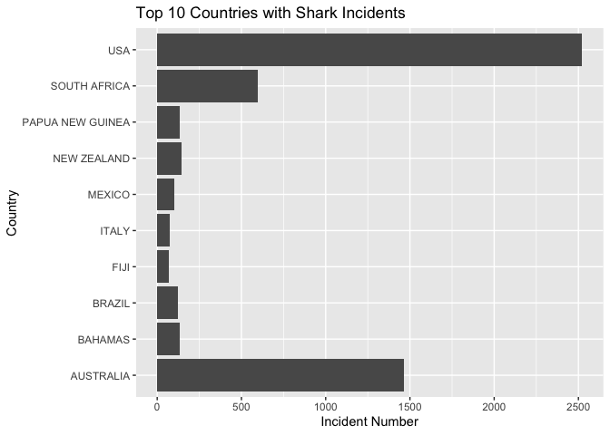

## Instructions
Answer the following questions and complete the exercises in RMarkdown. Please embed all of your code and push your final work to your repository. Your code must be organized, clean, and run free from errors. Remember, you must remove the `#` for any included code chunks to run. Be sure to add your name to the author header above. 

Your code must knit in order to be considered. If you are stuck and cannot answer a question, then comment out your code and knit the document.  

Don't forget to answer any questions that are asked in the prompt. Some questions will require a plot, but others do not- make sure to read each question carefully.  

For the questions that require a plot, make sure to have clearly labeled axes and a title. Keep your plots clean and professional-looking, but you are free to add color and other aesthetics.  

Be sure to follow the directions and push your code to your repository.

## Background
In the `data` folder, you will find data about global shark attacks. The data are updated continuously, and are taken from [opendatasoft](https://public.opendatasoft.com/explore/dataset/global-shark-attack/table/?flg=en-us&disjunctive.country&disjunctive.area&disjunctive.activity).  

## Load the libraries

```r
library("tidyverse")
library("janitor")
library("naniar")
```

## Load the data
Run the following code chunk to import the data.

```r
global_sharks <- read_csv("data/global-shark-attack.csv") %>% clean_names()
```

## Questions
1. (2 points) Start by doing some data exploration using your preferred function(s). What is the structure of the data? Where are the missing values and how are they represented?  

```r
str(global_sharks)
```

```
## spc_tbl_ [6,890 × 21] (S3: spec_tbl_df/tbl_df/tbl/data.frame)
##  $ date                  : Date[1:6890], format: "2023-07-29" "2023-04-22" ...
##  $ year                  : num [1:6890] 2023 2023 2023 2023 2022 ...
##  $ type                  : chr [1:6890] "Unprovoked" "Unprovoked" "Unprovoked" "Questionable" ...
##  $ country               : chr [1:6890] "USA" "AUSTRALIA" "SEYCHELLES" "ARGENTINA" ...
##  $ area                  : chr [1:6890] "Florida" "Western Australia" "Praslin Island" "Patagonia" ...
##  $ location              : chr [1:6890] "Tampa Bay" "Lucy's Beach" NA "Chubut Province" ...
##  $ activity              : chr [1:6890] "Swimming" "Surfing" "Snorkeling" NA ...
##  $ name                  : chr [1:6890] "Natalie Branda" "Max Marsden" "Arthur \xc9" "Diego Barr\x92a" ...
##  $ sex                   : chr [1:6890] "F" "M" "M" "M" ...
##  $ age                   : chr [1:6890] "26" "30" "6" "32" ...
##  $ injury                : chr [1:6890] "Superficial injuries to abomen and thighs" "Bite to right arm" "Left foot bitten" "Death by misadventure" ...
##  $ fatal_y_n             : chr [1:6890] "N" "N" "UNKNOWN" "UNKNOWN" ...
##  $ time                  : chr [1:6890] "20h00" "07h15" "Afternoon" NA ...
##  $ species               : chr [1:6890] NA "Bronze whaler shark, 1.5 m" "Lemon shark" NA ...
##  $ investigator_or_source: chr [1:6890] "Fox12, 8/1/2023" "The West Australian, 4/22/2023" "Midlibre, 3/18/2023" "El Pais,  2/27/2023" ...
##  $ pdf                   : chr [1:6890] NA NA NA NA ...
##  $ href_formula          : chr [1:6890] NA NA NA NA ...
##  $ href                  : chr [1:6890] NA NA NA NA ...
##  $ case_number_19        : chr [1:6890] NA NA NA NA ...
##  $ case_number_20        : chr [1:6890] NA NA NA NA ...
##  $ original_order        : num [1:6890] NA NA NA NA 6792 ...
##  - attr(*, "spec")=
##   .. cols(
##   ..   Date = col_date(format = ""),
##   ..   Year = col_double(),
##   ..   Type = col_character(),
##   ..   Country = col_character(),
##   ..   Area = col_character(),
##   ..   Location = col_character(),
##   ..   Activity = col_character(),
##   ..   Name = col_character(),
##   ..   Sex = col_character(),
##   ..   Age = col_character(),
##   ..   Injury = col_character(),
##   ..   `Fatal (Y/N)` = col_character(),
##   ..   Time = col_character(),
##   ..   Species = col_character(),
##   ..   `Investigator or Source` = col_character(),
##   ..   pdf = col_character(),
##   ..   `href formula` = col_character(),
##   ..   href = col_character(),
##   ..   `Case Number...19` = col_character(),
##   ..   `Case Number...20` = col_character(),
##   ..   `original order` = col_double()
##   .. )
##  - attr(*, "problems")=<externalptr>
```

```r
miss_var_summary(global_sharks)
```

```
## # A tibble: 21 × 3
##    variable n_miss pct_miss
##    <chr>     <int>    <dbl>
##  1 time       3518    51.1 
##  2 species    3118    45.3 
##  3 age        2982    43.3 
##  4 activity    586     8.51
##  5 sex         572     8.30
##  6 location    565     8.20
##  7 area        481     6.98
##  8 date        305     4.43
##  9 name        220     3.19
## 10 year        132     1.92
## # ℹ 11 more rows
```
It has 21 variables with 6890 observations. Missing data are shown as NA.  

2. (3 points) Are there any "hotspots" for shark incidents? Make a plot that shows the total number of incidents for the top 10 countries? Which country has the highest number of incidents?

```r
global_sharks %>%
  group_by(country) %>%
  summarise(incident_total = n()) %>%
  top_n(10) %>%
  arrange(incident_total)%>%
  ggplot(aes(x=country,y=incident_total))+
  geom_col()+
  labs(title = "Top 10 Countries with Shark Incidents",
    x="Country",
    y="Incident Number")+
  coord_flip()
```

```
## Selecting by incident_total
```

<!-- -->
USA has most shark incidents.  

3. (3 points) Are there months of the year when incidents are more likely to occur? Make a plot that shows the total number of incidents by month. Which month has the highest number of incidents?

```r
global_sharks %>%
  separate(date, into=c("year_1", "month", "day"), sep="-") %>%
  filter(month != "NA")%>%
  ggplot(aes(x=month))+
  geom_bar()+
  labs(title = "Shark Incidents in Each Month",
    x="Month",
    y="Incident Number")
```

<!-- -->


4. (3 points) Which activity is associated with the highest number of incidents? Make a plot that compares the top 5 riskiest activities. "NA" should not be classified as an activity.

```r
global_sharks %>%
  filter(activity != "NA")%>%
  group_by(activity)%>%
  summarise(incident_total=n())%>%
  top_n(5)%>%
  ggplot(aes(x=activity,y=incident_total))+
  geom_col()+
  labs(title = "Shark Incidents vs. Activities",
    x="Activity",
    y="Incident Number")
```

```
## Selecting by incident_total
```

<!-- -->
Surfing is most related to shark incidents.  

5. (3 points) The data include information on who was attacked. Make a plot that shows the total number of fatalities by sex- are males or females more likely to be killed by sharks?

```r
global_sharks %>%
  filter(fatal_y_n == "Y")%>%
  filter(sex == "F" | sex == "M")%>%
  ggplot(aes(x=sex))+
  geom_bar()+
  labs(title = "Fatal Shark Incidents vs. Sex",
    x="Sex",
    y="Incident Number")
```

<!-- -->

Males are more likely killed by sharks.  

6. (3 points) Make a plot that shows the range of age for the individuals that are attacked. Make sure to restrict sex to M or F (some of the codes used are not clear). You will also need to find a way to manage the messy age column.

```r
global_sharks$age <- as.numeric(global_sharks$age)
```

```
## Warning: NAs introduced by coercion
```

```r
global_sharks %>%
  filter(sex == "F" | sex == "M")%>%
  ggplot(aes(x=sex,y=age))+
  geom_boxplot()+
  labs(title = "Shark Incidents Age Range",
    x="Sex",
    y="Age")
```

```
## Warning: Removed 2568 rows containing non-finite values (`stat_boxplot()`).
```

<!-- -->


7. (3 points) In the United States, what are the top 5 states where shark attacks have been recorded since 1950? Make a plot that compares the number of incidents for these 5 states.

```r
global_sharks %>%
  filter(country == "USA") %>%
  group_by(area) %>%
  summarise(incident_total = n())%>%
  top_n(5)%>%
  ggplot(aes(x=area,y=incident_total))+
  geom_col()+
  labs(title = "Shark Incidents in Top 5 States",
    x="States",
    y="Incident Numbers")
```

```
## Selecting by incident_total
```

<!-- -->
Florida has most incidents.  


8. (3 points) Make a new object that limits the data to only include attacks attributed to Great White Sharks. This is trickier than it sounds, you should end up with 494 observations. Look online and adapt code involving `str_detect`. Which country has the highest number of Great White Shark attacks?

```r
global_sharks %>%
  filter(str_detect(species, "White"))%>% #There are White sharks and White Sharks, which makes things tricky.
  group_by(country) %>%
  summarise(incident_total = n()) %>%
  arrange(-incident_total)
```

```
## # A tibble: 36 × 2
##    country      incident_total
##    <chr>                 <int>
##  1 USA                     151
##  2 AUSTRALIA               135
##  3 SOUTH AFRICA            124
##  4 NEW ZEALAND              17
##  5 ITALY                    16
##  6 CROATIA                   9
##  7 GREECE                    4
##  8 CHILE                     3
##  9 BAHAMAS                   2
## 10 CANADA                    2
## # ℹ 26 more rows
```

USA has most Great White Shark attacks.  

9. (4 points) Use faceting to compare the number of fatal and non-fatal attacks for the top 5 countries with the highest number of Great White Shark attacks.

```r
global_sharks %>%
  filter(country == c("USA", "AUSTRALIA", "SOUTH AFRICA", "NEW ZEALAND", "ITALY")) %>% 
  group_by(country) %>%
  filter(fatal_y_n == "Y" | fatal_y_n == "N") %>%
  ggplot(aes(x=fatal_y_n))+
  geom_bar()+
  facet_wrap(~country)+
  labs(title = "Great White Shark Incidents Fatality",
    x="Fatality",
    y="Incident Numbers")
```

<!-- -->


10. (3 points) Using the `global_sharks` data, what is one question that you are interested in exploring? Write the question and answer it using a plot or table. 
Question: Which year has most shark accident?

```r
global_sharks %>%
  group_by(year) %>%
  summarise(incident_total=n()) %>%
  arrange(-incident_total)
```

```
## # A tibble: 256 × 2
##     year incident_total
##    <dbl>          <int>
##  1  2015            143
##  2  2017            139
##  3    NA            132
##  4  2016            131
##  5  2011            128
##  6  2014            126
##  7  2018            124
##  8  2008            122
##  9  2013            122
## 10  2009            120
## # ℹ 246 more rows
```
2015 has most shark_related incidents.

