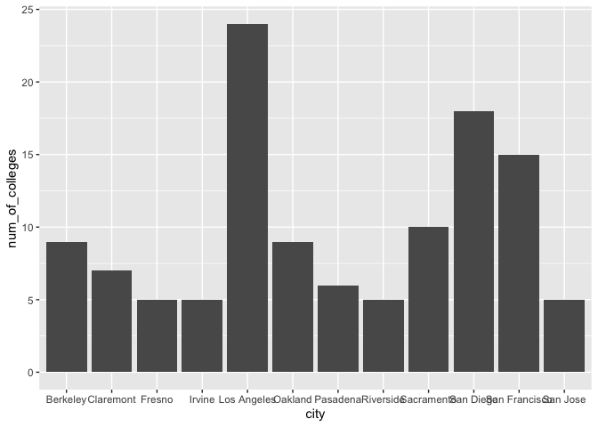
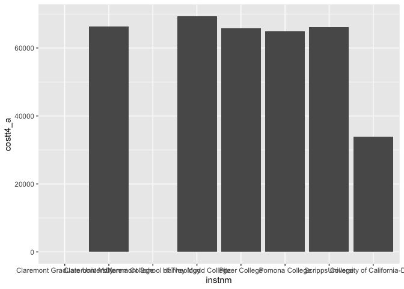
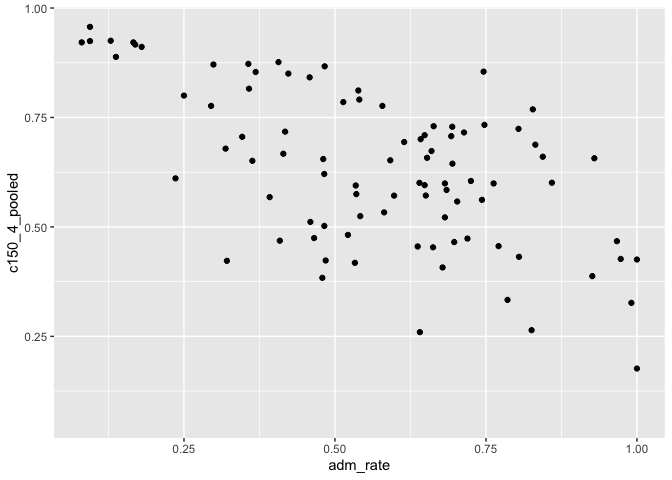
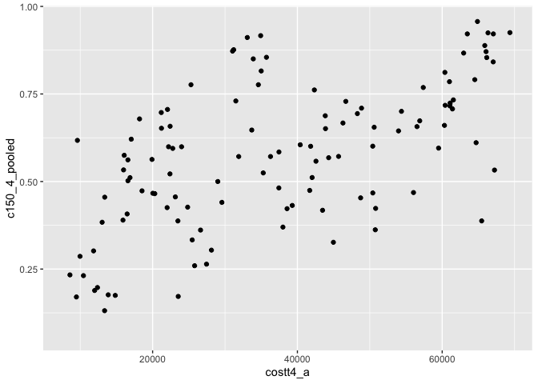
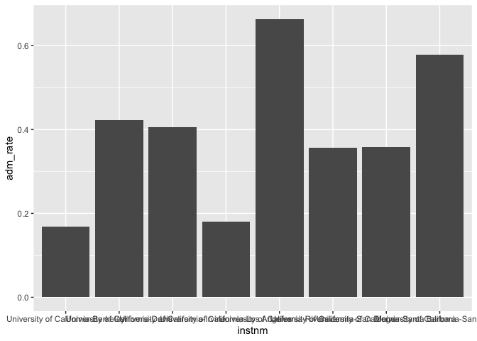
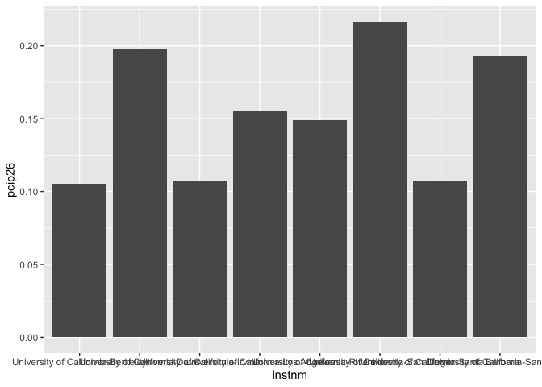

## Instructions
Answer the following questions and complete the exercises in RMarkdown. Please embed all of your code and push your final work to your repository. Your final lab report should be organized, clean, and run free from errors. Remember, you must remove the `#` for the included code chunks to run. Be sure to add your name to the author header above.  

Make sure to use the formatting conventions of RMarkdown to make your report neat and clean!  

## Load the libraries

```r
library(tidyverse)
library(janitor)
library(here)
library(naniar)
```

For this homework, we will take a departure from biological data and use data about California colleges. These data are a subset of the national college scorecard (https://collegescorecard.ed.gov/data/). Load the `ca_college_data.csv` as a new object called `colleges`.

```r
colleges <- read_csv("data/ca_college_data.csv") %>% clean_names()
```

```
## Rows: 341 Columns: 10
## ── Column specification ────────────────────────────────────────────────────────
## Delimiter: ","
## chr (4): INSTNM, CITY, STABBR, ZIP
## dbl (6): ADM_RATE, SAT_AVG, PCIP26, COSTT4_A, C150_4_POOLED, PFTFTUG1_EF
## 
## ℹ Use `spec()` to retrieve the full column specification for this data.
## ℹ Specify the column types or set `show_col_types = FALSE` to quiet this message.
```

The variables are a bit hard to decipher, here is a key:  

INSTNM: Institution name  
CITY: California city  
STABBR: Location state  
ZIP: Zip code  
ADM_RATE: Admission rate  
SAT_AVG: SAT average score  
PCIP26: Percentage of degrees awarded in Biological And Biomedical Sciences  
COSTT4_A: Annual cost of attendance  
C150_4_POOLED: 4-year completion rate  
PFTFTUG1_EF: Percentage of undergraduate students who are first-time, full-time degree/certificate-seeking undergraduate students  

1. Use your preferred function(s) to have a look at the data and get an idea of its structure. Make sure you summarize NA's and determine whether or not the data are tidy. You may also consider dealing with any naming issues.

```r
str(colleges)
```

```
## spc_tbl_ [341 × 10] (S3: spec_tbl_df/tbl_df/tbl/data.frame)
##  $ instnm       : chr [1:341] "Grossmont College" "College of the Sequoias" "College of San Mateo" "Ventura College" ...
##  $ city         : chr [1:341] "El Cajon" "Visalia" "San Mateo" "Ventura" ...
##  $ stabbr       : chr [1:341] "CA" "CA" "CA" "CA" ...
##  $ zip          : chr [1:341] "92020-1799" "93277-2214" "94402-3784" "93003-3872" ...
##  $ adm_rate     : num [1:341] NA NA NA NA NA NA NA NA NA NA ...
##  $ sat_avg      : num [1:341] NA NA NA NA NA NA NA NA NA NA ...
##  $ pcip26       : num [1:341] 0.0016 0.0066 0.0038 0.0035 0.0085 0.0151 0 0.002 0.0021 0.0324 ...
##  $ costt4_a     : num [1:341] 7956 8109 8278 8407 8516 ...
##  $ c150_4_pooled: num [1:341] NA NA NA NA NA ...
##  $ pftftug1_ef  : num [1:341] 0.355 0.541 0.357 0.382 0.275 ...
##  - attr(*, "spec")=
##   .. cols(
##   ..   INSTNM = col_character(),
##   ..   CITY = col_character(),
##   ..   STABBR = col_character(),
##   ..   ZIP = col_character(),
##   ..   ADM_RATE = col_double(),
##   ..   SAT_AVG = col_double(),
##   ..   PCIP26 = col_double(),
##   ..   COSTT4_A = col_double(),
##   ..   C150_4_POOLED = col_double(),
##   ..   PFTFTUG1_EF = col_double()
##   .. )
##  - attr(*, "problems")=<externalptr>
```

```r
miss_var_summary(colleges)
```

```
## # A tibble: 10 × 3
##    variable      n_miss pct_miss
##    <chr>          <int>    <dbl>
##  1 sat_avg          276     80.9
##  2 adm_rate         240     70.4
##  3 c150_4_pooled    221     64.8
##  4 costt4_a         124     36.4
##  5 pftftug1_ef       53     15.5
##  6 pcip26            35     10.3
##  7 instnm             0      0  
##  8 city               0      0  
##  9 stabbr             0      0  
## 10 zip                0      0
```
It is tidy.  
2. Which cities in California have the highest number of colleges?

```r
colleges %>%
  group_by(city) %>%
  summarise(num_of_colleges = n()) %>%
  arrange(-num_of_colleges)
```

```
## # A tibble: 161 × 2
##    city          num_of_colleges
##    <chr>                   <int>
##  1 Los Angeles                24
##  2 San Diego                  18
##  3 San Francisco              15
##  4 Sacramento                 10
##  5 Berkeley                    9
##  6 Oakland                     9
##  7 Claremont                   7
##  8 Pasadena                    6
##  9 Fresno                      5
## 10 Irvine                      5
## # ℹ 151 more rows
```
Los Angeles.  
3. Based on your answer to #2, make a plot that shows the number of colleges in the top 10 cities.

```r
colleges %>%
  group_by(city) %>%
  summarise(num_of_colleges = n()) %>%
  top_n(10,num_of_colleges) %>%
  ggplot(aes(x=city,y=num_of_colleges)) +
  geom_col()
```

<!-- -->

4. The column `COSTT4_A` is the annual cost of each institution. Which city has the highest average cost? Where is it located?

```r
colleges %>%
  group_by(city) %>%
  summarise(ave_cost = mean(costt4_a, na.rm = T)) %>%
  arrange(-ave_cost)
```

```
## # A tibble: 161 × 2
##    city                ave_cost
##    <chr>                  <dbl>
##  1 Claremont              66498
##  2 Malibu                 66152
##  3 Valencia               64686
##  4 Orange                 64501
##  5 Redlands               61542
##  6 Moraga                 61095
##  7 Atherton               56035
##  8 Thousand Oaks          54373
##  9 Rancho Palos Verdes    50758
## 10 La Verne               50603
## # ℹ 151 more rows
```

```r
colleges %>% 
  filter(city == "Claremont") %>%
  select(stabbr, city)
```

```
## # A tibble: 7 × 2
##   stabbr city     
##   <chr>  <chr>    
## 1 CA     Claremont
## 2 CA     Claremont
## 3 CA     Claremont
## 4 CA     Claremont
## 5 CA     Claremont
## 6 CA     Claremont
## 7 CA     Claremont
```
Claremont have the highest annual cost. It locates in California.
5. Based on your answer to #4, make a plot that compares the cost of the individual colleges in the most expensive city. Bonus! Add UC Davis here to see how it compares :>).

```r
colleges %>%
  filter(city == "Claremont" | instnm == "University of California-Davis") %>%
  ggplot(aes(x=instnm, y=costt4_a)) +
  geom_col()
```

```
## Warning: Removed 2 rows containing missing values (`position_stack()`).
```

<!-- -->

6. The column `ADM_RATE` is the admissions rate by college and `C150_4_POOLED` is the four-year completion rate. Use a scatterplot to show the relationship between these two variables. What do you think this means?

```r
colleges %>%
  ggplot(aes(x=adm_rate,y=c150_4_pooled)) +
  geom_point()
```

```
## Warning: Removed 251 rows containing missing values (`geom_point()`).
```

<!-- -->
Higher admission rate is related to lower completion rate.  
7. Is there a relationship between cost and four-year completion rate? (You don't need to do the stats, just produce a plot). What do you think this means?

```r
colleges %>%
  ggplot(aes(x=costt4_a,y=c150_4_pooled)) +
  geom_point()
```

```
## Warning: Removed 225 rows containing missing values (`geom_point()`).
```

<!-- -->
Higher cost is related to higher completion rate.  
8. The column titled `INSTNM` is the institution name. We are only interested in the University of California colleges. Make a new data frame that is restricted to UC institutions. You can remove `Hastings College of Law` and `UC San Francisco` as we are only interested in undergraduate institutions.


Remove `Hastings College of Law` and `UC San Francisco` and store the final data frame as a new object `univ_calif_final`.

```r
univ_calif_final <- colleges %>%
  filter(instnm %in% c("University of California-San Diego", "University of California-Irvine", "University of California-Riverside", "University of California-Los Angeles", "University of California-Davis", "University of California-Santa Cruz", "University of California-Berkeley", "University of California-Santa Barbara"))
```

Use `separate()` to separate institution name into two new columns "UNIV" and "CAMPUS".

```r
univ_calif_final %>%
  separate(instnm, into= c("UNIV", "CAMPUS"), sep = "-")
```

```
## # A tibble: 8 × 11
##   UNIV  CAMPUS city  stabbr zip   adm_rate sat_avg pcip26 costt4_a c150_4_pooled
##   <chr> <chr>  <chr> <chr>  <chr>    <dbl>   <dbl>  <dbl>    <dbl>         <dbl>
## 1 Univ… San D… La J… CA     92093    0.357    1324  0.216    31043         0.872
## 2 Univ… Irvine Irvi… CA     92697    0.406    1206  0.107    31198         0.876
## 3 Univ… River… Rive… CA     92521    0.663    1078  0.149    31494         0.73 
## 4 Univ… Los A… Los … CA     9009…    0.180    1334  0.155    33078         0.911
## 5 Univ… Davis  Davis CA     9561…    0.423    1218  0.198    33904         0.850
## 6 Univ… Santa… Sant… CA     9506…    0.578    1201  0.193    34608         0.776
## 7 Univ… Berke… Berk… CA     94720    0.169    1422  0.105    34924         0.916
## 8 Univ… Santa… Sant… CA     93106    0.358    1281  0.108    34998         0.816
## # ℹ 1 more variable: pftftug1_ef <dbl>
```

9. The column `ADM_RATE` is the admissions rate by campus. Which UC has the lowest and highest admissions rates? Produce a numerical summary and an appropriate plot.

```r
univ_calif_final %>%
  select(instnm, adm_rate) %>%
  arrange(adm_rate)
```

```
## # A tibble: 8 × 2
##   instnm                                 adm_rate
##   <chr>                                     <dbl>
## 1 University of California-Berkeley         0.169
## 2 University of California-Los Angeles      0.180
## 3 University of California-San Diego        0.357
## 4 University of California-Santa Barbara    0.358
## 5 University of California-Irvine           0.406
## 6 University of California-Davis            0.423
## 7 University of California-Santa Cruz       0.578
## 8 University of California-Riverside        0.663
```
Berkely have lowest admission rate and Riverside have highest.

```r
univ_calif_final %>%
  arrange(adm_rate) %>%
  ggplot(aes(x=instnm,y=adm_rate)) +
  geom_col()
```

<!-- -->

10. If you wanted to get a degree in biological or biomedical sciences, which campus confers the majority of these degrees? Produce a numerical summary and an appropriate plot.

```r
univ_calif_final %>%
  select(instnm, pcip26) %>%
  arrange(-pcip26)
```

```
## # A tibble: 8 × 2
##   instnm                                 pcip26
##   <chr>                                   <dbl>
## 1 University of California-San Diego      0.216
## 2 University of California-Davis          0.198
## 3 University of California-Santa Cruz     0.193
## 4 University of California-Los Angeles    0.155
## 5 University of California-Riverside      0.149
## 6 University of California-Santa Barbara  0.108
## 7 University of California-Irvine         0.107
## 8 University of California-Berkeley       0.105
```
UC San Diego

```r
univ_calif_final %>%
  arrange(-pcip26) %>%
  ggplot(aes(x=instnm,y=pcip26)) +
  geom_col()
```

<!-- -->

## Knit Your Output and Post to [GitHub](https://github.com/FRS417-DataScienceBiologists)
