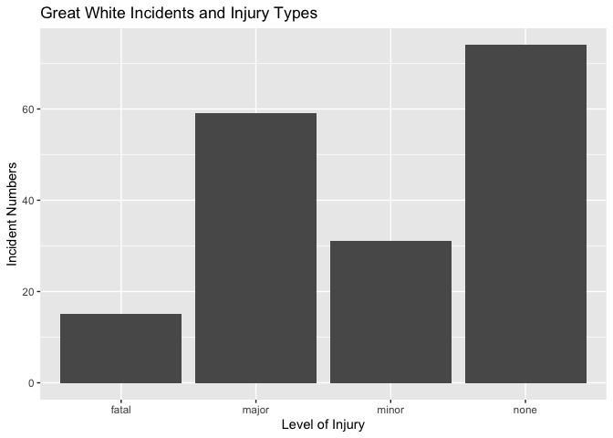

## Instructions
Answer the following questions and complete the exercises in RMarkdown. Please embed all of your code and push your final work to your repository. Your code must be organized, clean, and run free from errors. Remember, you must remove the `#` for any included code chunks to run. Be sure to add your name to the author header above. 

Your code must knit in order to be considered. If you are stuck and cannot answer a question, then comment out your code and knit the document. You may use your notes, labs, and homework to help you complete this exam. Do not use any other resources- including AI assistance.  

Don't forget to answer any questions that are asked in the prompt. Some questions will require a plot, but others do not- make sure to read each question carefully.  

For the questions that require a plot, make sure to have clearly labeled axes and a title. Keep your plots clean and professional-looking, but you are free to add color and other aesthetics.  

Be sure to follow the directions and upload your exam on Gradescope.    

## Background
In the `data` folder, you will find data about shark incidents in California between 1950-2022. The [data](https://catalog.data.gov/dataset/shark-incident-database-california-56167) are from: State of California- Shark Incident Database.   

## Load the libraries

```r
library("tidyverse")
library("janitor")
library("naniar")
```

## Load the data
Run the following code chunk to import the data.

```r
sharks <- read_csv("data/SharkIncidents_1950_2022_220302.csv") %>% clean_names()
```

## Questions
1. (1 point) Start by doing some data exploration using your preferred function(s). What is the structure of the data? Where are the missing values and how are they represented?  

```r
glimpse(sharks)
```

```
## Rows: 211
## Columns: 16
## $ incident_num     <chr> "1", "2", "3", "4", "5", "6", "7", "8", "9", "10", "1…
## $ month            <dbl> 10, 5, 12, 2, 8, 4, 10, 5, 6, 7, 10, 11, 4, 5, 5, 8, …
## $ day              <dbl> 8, 27, 7, 6, 14, 28, 12, 7, 14, 28, 4, 10, 24, 19, 21…
## $ year             <dbl> 1950, 1952, 1952, 1955, 1956, 1957, 1958, 1959, 1959,…
## $ time             <chr> "12:00", "14:00", "14:00", "12:00", "16:30", "13:30",…
## $ county           <chr> "San Diego", "San Diego", "Monterey", "Monterey", "Sa…
## $ location         <chr> "Imperial Beach", "Imperial Beach", "Lovers Point", "…
## $ mode             <chr> "Swimming", "Swimming", "Swimming", "Freediving", "Sw…
## $ injury           <chr> "major", "minor", "fatal", "minor", "major", "fatal",…
## $ depth            <chr> "surface", "surface", "surface", "surface", "surface"…
## $ species          <chr> "White", "White", "White", "White", "White", "White",…
## $ comment          <chr> "Body Surfing, bit multiple times on leg, thigh and b…
## $ longitude        <chr> "-117.1466667", "-117.2466667", "-122.05", "-122.15",…
## $ latitude         <dbl> 32.58833, 32.58833, 36.62667, 36.62667, 35.13833, 35.…
## $ confirmed_source <chr> "Miller/Collier, Coronado Paper, Oceanside Paper", "G…
## $ wfl_case_number  <chr> NA, NA, NA, NA, NA, NA, NA, NA, NA, NA, NA, NA, NA, N…
```

```r
dim(sharks)
```

```
## [1] 211  16
```
It has 16 variables and 211 observations. The missing values are represented as NA and Unknown. 

2. (1 point) Notice that there are some incidents identified as "NOT COUNTED". These should be removed from the data because they were either not sharks, unverified, or were provoked. It's OK to replace the `sharks` object.

```r
sharks <- sharks %>%
  filter(incident_num != "NOT COUNTED")
sharks$incident_num = as.double(sharks$incident_num) 
```

3. (3 points) Are there any "hotspots" for shark incidents in California? Make a plot that shows the total number of incidents per county. Which county has the highest number of incidents?

```r
sharks %>%
  ggplot(aes(x=county,y=incident_num)) +
  geom_col() +
  labs(title = "Shark Incidents in Each County of California",
       x="County",
       y="Incident Numbers")+
  coord_flip()
```

<!-- -->
Santa Cruz has the highest number of incidents.  

4. (3 points) Are there months of the year when incidents are more likely to occur? Make a plot that shows the total number of incidents by month. Which month has the highest number of incidents?  

```r
sharks %>%
  ggplot(aes(x=month,y=incident_num))+
  geom_col()+
  labs(title = "Shark Incidents in Different Month",
       x="Month",
       y="Incident Numbers") 
```

<!-- -->
October has most incidents.  

5. (3 points) How do the number and types of injuries compare by county? Make a table (not a plot) that shows the number of injury types by county. Which county has the highest number of fatalities?  

```r
sharks %>%
  group_by(county,injury) %>%
  filter(injury == "fatal") %>%
  summarise(incident_total = sum(incident_num)) %>%
  arrange(-incident_total)
```

```
## `summarise()` has grouped output by 'county'. You can override using the
## `.groups` argument.
```

```
## # A tibble: 10 × 3
## # Groups:   county [10]
##    county              injury incident_total
##    <chr>               <chr>           <dbl>
##  1 San Luis Obispo     fatal             310
##  2 Santa Barbara       fatal             289
##  3 Santa Cruz          fatal             192
##  4 San Diego           fatal             136
##  5 Mendocino           fatal             103
##  6 Island - San Miguel fatal              82
##  7 Los Angeles         fatal              62
##  8 San Mateo           fatal              50
##  9 Monterey            fatal              48
## 10 San Francisco       fatal               8
```

```r
sharks %>%
  group_by(county,injury) %>%
  summarise(incident_total = sum(incident_num)) 
```

```
## `summarise()` has grouped output by 'county'. You can override using the
## `.groups` argument.
```

```
## # A tibble: 57 × 3
## # Groups:   county [21]
##    county              injury incident_total
##    <chr>               <chr>           <dbl>
##  1 Del Norte           minor             172
##  2 Del Norte           none               73
##  3 Humboldt            major             766
##  4 Humboldt            minor             104
##  5 Humboldt            none             1106
##  6 Island - Catalina   minor             199
##  7 Island - Catalina   none              461
##  8 Island - Farallones major             372
##  9 Island - San Miguel fatal              82
## 10 Island - San Miguel major             245
## # ℹ 47 more rows
```
San Luis Obispo has the most number of fatalities.  

6. (2 points) In the data, `mode` refers to a type of activity. Which activity is associated with the highest number of incidents?

```r
sharks %>%
  ggplot(aes(x=mode,y=incident_num))+
  geom_col()+
  labs(title = "Shark Incidents vs. Type of Ativity",
      x="Type of Activity",
      y="Incident Numbers")+
  coord_flip()+
  theme(axis.text.y=element_text(angle=45,hjust=1))
```

<!-- -->
Surfing/Boarding is most related to shark incidents.  

7. (4 points) Use faceting to make a plot that compares the number and types of injuries by activity. (hint: the x axes should be the type of injury) 

```r
sharks %>%
  ggplot(aes(x=injury,y=incident_num))+
  geom_col()+
  facet_wrap(~mode)+
  labs(title = "Shark Incidents'Level vs. Type of Ativity",
    x="Level of Injury",
    y="Incident Numbers")
```

<!-- -->

8. (1 point) Which shark species is involved in the highest number of incidents?  

```r
sharks %>%
  group_by(species) %>%
  summarise(incident_total = sum(incident_num)) %>%
  arrange(-incident_total)
```

```
## # A tibble: 8 × 2
##   species    incident_total
##   <chr>               <dbl>
## 1 White               18374
## 2 Unknown              1447
## 3 Hammerhead            344
## 4 Leopard               261
## 5 Thresher              187
## 6 Salmon                154
## 7 Sevengill             140
## 8 Blue                   63
```
White Shark is involved in the highest number of incidents.  

9. (3 points) Are all incidents involving Great White's fatal? Make a plot that shows the number and types of injuries for Great White's only.  

```r
sharks %>%
  filter(species=="White") %>%
  ggplot(aes(x=injury,y=incident_num))+
  geom_col()+
   labs(title = "Great White Incidents and Injury Types",
    x="Level of Injury",
    y="Incident Numbers")+
  theme_gray()
```

<!-- -->

## Background
Let's learn a little bit more about Great White sharks by looking at a small dataset that tracked 20 Great White's in the Fallaron Islands. The [data](https://link.springer.com/article/10.1007/s00227-007-0739-4) are from: Weng et al. (2007) Migration and habitat of white sharks (_Carcharodon carcharias_) in the eastern Pacific Ocean.

## Load the data

```r
white_sharks <- read_csv("data/White sharks tracked from Southeast Farallon Island, CA, USA, 1999 2004.csv", na = c("?", "n/a")) %>% clean_names()
```

10. (1 point) Start by doing some data exploration using your preferred function(s). What is the structure of the data? Where are the missing values and how are they represented?

```r
str(white_sharks)
```

```
## spc_tbl_ [20 × 10] (S3: spec_tbl_df/tbl_df/tbl/data.frame)
##  $ shark          : chr [1:20] "1-M" "2-M" "3-M" "4-M" ...
##  $ tagging_date   : chr [1:20] "19-Oct-99" "30-Oct-99" "16-Oct-00" "5-Nov-01" ...
##  $ total_length_cm: num [1:20] 402 366 457 457 488 427 442 380 450 530 ...
##  $ sex            : chr [1:20] "M" "M" "M" "M" ...
##  $ maturity       : chr [1:20] "Mature" "Adolescent" "Mature" "Mature" ...
##  $ pop_up_date    : chr [1:20] "2-Nov-99" "25-Nov-99" "16-Apr-01" "6-May-02" ...
##  $ track_days     : num [1:20] 14 26 182 182 256 275 35 60 209 91 ...
##  $ longitude      : num [1:20] -124 -126 -157 -141 -133 ...
##  $ latitude       : num [1:20] 39 38.7 20.7 26.4 21.1 ...
##  $ comment        : chr [1:20] "Nearshore" "Nearshore" "To Hawaii" "To Hawaii" ...
##  - attr(*, "spec")=
##   .. cols(
##   ..   Shark = col_character(),
##   ..   `Tagging date` = col_character(),
##   ..   `Total length(cm)` = col_double(),
##   ..   Sex = col_character(),
##   ..   Maturity = col_character(),
##   ..   `Pop-up date` = col_character(),
##   ..   `Track days` = col_double(),
##   ..   `Longitude(°)` = col_double(),
##   ..   `Latitude(°)` = col_double(),
##   ..   Comment = col_character()
##   .. )
##  - attr(*, "problems")=<externalptr>
```

```r
glimpse(white_sharks)
```

```
## Rows: 20
## Columns: 10
## $ shark           <chr> "1-M", "2-M", "3-M", "4-M", "5-F", "6-M", "7-F", "8-M"…
## $ tagging_date    <chr> "19-Oct-99", "30-Oct-99", "16-Oct-00", "5-Nov-01", "5-…
## $ total_length_cm <dbl> 402, 366, 457, 457, 488, 427, 442, 380, 450, 530, 427,…
## $ sex             <chr> "M", "M", "M", "M", "F", "M", "F", "M", "M", "F", NA, …
## $ maturity        <chr> "Mature", "Adolescent", "Mature", "Mature", "Mature", …
## $ pop_up_date     <chr> "2-Nov-99", "25-Nov-99", "16-Apr-01", "6-May-02", "19-…
## $ track_days      <dbl> 14, 26, 182, 182, 256, 275, 35, 60, 209, 91, 182, 240,…
## $ longitude       <dbl> -124.49, -125.97, -156.80, -141.47, -133.25, -138.83, …
## $ latitude        <dbl> 38.95, 38.69, 20.67, 26.39, 21.13, 26.50, 37.07, 34.93…
## $ comment         <chr> "Nearshore", "Nearshore", "To Hawaii", "To Hawaii", "O…
```
It has 10 variables with 20 observations. Missing variables are presented as NA.  

11. (3 points) How do male and female sharks compare in terms of total length? Are males or females larger on average? Do a quick search online to verify your findings. (hint: this is a table, not a plot).  

```r
white_sharks %>%
  group_by(sex) %>%
  summarise(ave_length = mean(total_length_cm))
```

```
## # A tibble: 3 × 2
##   sex   ave_length
##   <chr>      <dbl>
## 1 F           462 
## 2 M           425.
## 3 <NA>        425
```
Female Sharks are larger in average. According to [Wikipedia](https://en.wikipedia.org/wiki/Great_white_shark), females are generally larger than males.

12. (3 points) Make a plot that compares the range of total length by sex.

```r
white_sharks%>%
  filter(sex != "U") %>%
  ggplot(aes(x=sex,y=total_length_cm))+
  geom_boxplot()+
  labs(title = "Great White Shark Length vs. Sex",
    x="Sex",
    y="Length(cm)")
```

<!-- -->

13. (2 points) Using the `sharks` or the `white_sharks` data, what is one question that you are interested in exploring? Write the question and answer it using a plot or table.  
Question: In 'sharks' data, which year has the most number of shark related incidents?

```r
sharks %>%
  group_by(year) %>%
  summarise(total_incidents = sum(incident_num)) %>%
  arrange(-total_incidents)
```

```
## # A tibble: 63 × 2
##     year total_incidents
##    <dbl>           <dbl>
##  1  2020            1548
##  2  2017            1412
##  3  2021            1407
##  4  2015            1162
##  5  2014            1113
##  6  2007            1089
##  7  2012            1036
##  8  2019             935
##  9  2004             836
## 10  2018             730
## # ℹ 53 more rows
```
2020 has most shark related incidents. 
